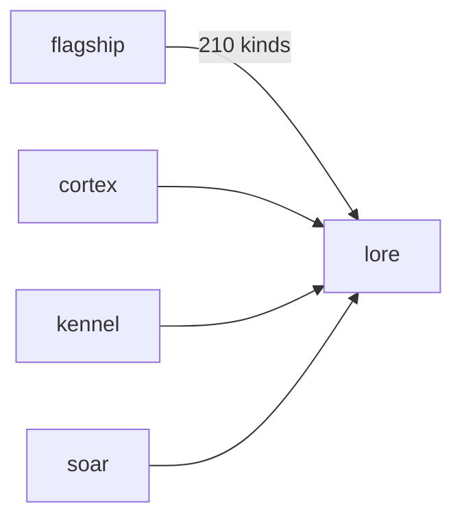

# Lore

**Pet Lore Wiki** — A planned species and lineage wiki with a shared vocabulary for ComputerPets canon.

Part of [ComputerPets](https://github.com/RicheyWorks/computerpets). Map: [computerpets-ecosystem](https://github.com/RicheyWorks/computerpets-ecosystem).

[Status](#status) · [Contract](docs/CONTRACT.md) · [Contributor start](#contributor-start) · [Ecosystem](https://github.com/RicheyWorks/computerpets-ecosystem)

| Project | At a glance |
| --- | --- |
| Status | Design scaffold; not runnable yet |
| License | MIT |
| First pet | [Flagship start guide](https://github.com/RicheyWorks/computerpets/blob/main/docs/START-HERE.md) |

## Status

This repository contains a [contract](docs/CONTRACT.md) and a [source placeholder](src/lore/index.ts). It has no runnable application, build manifest, automated tests, or CI workflow.

The experience, interfaces, integrations, and safeguards below are **implementation plans**, not supported features. The first implementation slice defines the initial contribution target.

## Planned role

210 living kinds. Lore is the book so Cortex, Kennel, and Atelier do not invent a quiet line back into existence — or a panda-fish.

For the desktop pet, start with the [flagship guide](https://github.com/RicheyWorks/computerpets/blob/main/docs/START-HERE.md).

## Intended audience

Cortex, Kennel, Atelier, Hatchery, Soar. The book.

## Out of scope

Not fanfic wiki anyone can overwrite in prod. Manual `/canon` wins over generation.

## Proposed integration



## Planned stack

TypeScript · VitePress / Astro · generated species pages from flagship data · canon lint

GroupId / namespace: `com.enterprisepet.lore`  
Proposed listen surface: `5173`

## Proposed contract

### Data

`SpeciesPage(id, habitat, taboo) · LineagePage(root, notable[]) · CanonTerm(name, kind)`

### Surface

- GET /species/{id} — canon page
- GET /lineages/{id} — notable whelps
- POST /v1/lint — text vs canon names

### Planned safeguards

Missing art → silhouette, never a wrong photo. Lint fail in Cortex → block the line. Manual edits live in /canon and win over generation.

## First implementation slice

Initial implementation target:

**Species pages for Rui, Paint, Reed + lint endpoint that Cortex must call.**

Acceptance targets: Missing art: silhouette, never a wrong photo. Panda×fish is a documented illegal.

## Planned environment

`SPECIES_JSON` from flagship

Never commit secrets. Never put Steam or chain keys in the overlay.

## Related projects

- [computerpets-cortex](https://github.com/RicheyWorks/computerpets-cortex)
- [computerpets-kennel](https://github.com/RicheyWorks/computerpets-kennel)
- [computerpets-atelier](https://github.com/RicheyWorks/computerpets-atelier)
- [computerpets-babel](https://github.com/RicheyWorks/computerpets-babel)

## Layout

```
computerpets-lore/
  README.md           this file
  LICENSE             MIT
  docs/CONTRACT.md    the same contract, frozen for implementers
  src/                implementation lands here
```

## Contributor start

With Git and PowerShell, clone the scaffold and read its contract and source marker:

```powershell
git clone https://github.com/RicheyWorks/computerpets-lore.git
Set-Location computerpets-lore
Get-Content .\docs\CONTRACT.md
Get-Content .\src\lore\index.ts
```

Start with the [first implementation slice](#first-implementation-slice). Add the minimum project setup and tests needed for that slice, then document verified run commands. The proposed stack above is a design choice; there is no install or launch command for this checkout yet.

## Links

- Flagship: [RicheyWorks/computerpets](https://github.com/RicheyWorks/computerpets)
- This repo: [RicheyWorks/computerpets-lore](https://github.com/RicheyWorks/computerpets-lore)
- Map: [RicheyWorks/computerpets-ecosystem](https://github.com/RicheyWorks/computerpets-ecosystem)
- Contract file: [docs/CONTRACT.md](docs/CONTRACT.md)

## License

MIT. See [LICENSE](LICENSE).

---

*Two hundred ten living kinds. Keep them so a line does not go quiet.*
