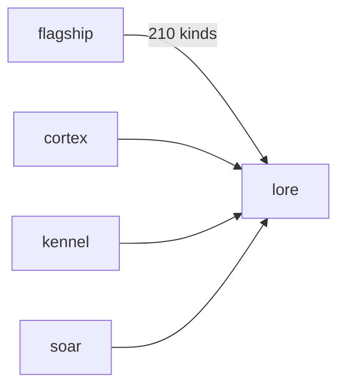

# Lore

**Pet Lore Wiki** — Auto-generated wiki documenting rare pet lineages, species canon, and illegal hybrids.

Part of [ComputerPets](https://github.com/RicheyWorks/computerpets). Map: [computerpets-ecosystem](https://github.com/RicheyWorks/computerpets-ecosystem).

| | |
| --- | --- |
| Status | Design scaffold — contract frozen, implementation next |
| License | MIT |
| First pet | Still [Rui on the desktop](https://github.com/RicheyWorks/computerpets/blob/main/docs/START-HERE.md). This organ is optional. |

## The job

210 living kinds. Lore is the book so Cortex, Kennel, and Atelier do not invent a quiet line back into existence — or a panda-fish.

The flagship overlay already puts a living sticker on the real desktop (Rui first, 210 kinds). Lore does not replace that. It is one organ.

## Who uses it

Cortex, Kennel, Atelier, Hatchery, Soar. The book.

## What it is not

Not fanfic wiki anyone can overwrite in prod. Manual `/canon` wins over generation.

## Architecture



## Stack

TypeScript · VitePress / Astro · generated species pages from flagship data · canon lint

GroupId / namespace: `com.enterprisepet.lore`  
Default listen: `5173`

## Contract

### Data

`SpeciesPage(id, habitat, taboo) · LineagePage(root, notable[]) · CanonTerm(name, kind)`

### Surface

- GET /species/{id} — canon page
- GET /lineages/{id} — notable whelps
- POST /v1/lint — text vs canon names

### Failure doctrine

Missing art → silhouette, never a wrong photo. Lint fail in Cortex → block the line. Manual edits live in /canon and win over generation.

## First slice

Build this and stop. Do not boil the ocean.

**Species pages for Rui, Paint, Reed + lint endpoint that Cortex must call.**

You know it works when: Missing art: silhouette, never a wrong photo. Panda×fish is a documented illegal.

## Environment

`SPECIES_JSON` from flagship

Never commit secrets. Never put Steam or chain keys in the overlay.

## Neighbors

- computerpets-cortex
- computerpets-kennel
- computerpets-atelier
- computerpets-babel

## Layout

```
computerpets-lore/
  README.md           this file
  LICENSE             MIT
  docs/CONTRACT.md    the same contract, frozen for implementers
  src/                implementation lands here
```

## Run (Windows)

PowerShell, from this folder, after the flagship helpers (Git, Node LTS 22+, JDK 21 as needed):

```powershell
npm install; npm run docs:dev
```

You do not need this service to meet Rui. The [flagship start-here](https://github.com/RicheyWorks/computerpets/blob/main/docs/START-HERE.md) is still the first pet.

## Links

- Flagship: [RicheyWorks/computerpets](https://github.com/RicheyWorks/computerpets)
- This repo: [RicheyWorks/computerpets-lore](https://github.com/RicheyWorks/computerpets-lore)
- Map: [RicheyWorks/computerpets-ecosystem](https://github.com/RicheyWorks/computerpets-ecosystem)
- Contract file: [docs/CONTRACT.md](docs/CONTRACT.md)

## License

MIT. See [LICENSE](LICENSE).

---

*Two hundred ten living kinds. Keep them so a line does not go quiet.*
